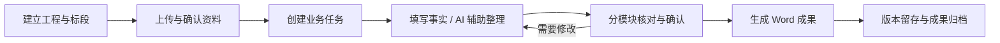
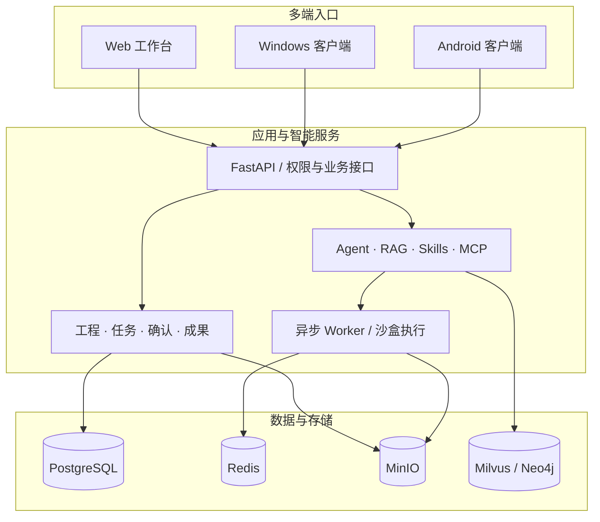

<div align="center">

# 筑衡 Agent

### 水利工程智能协作平台

**从现场记录到工程成果，让资料、知识与协作贯穿每一次交付。**

[](LICENSE)


[核心能力](#核心能力) · [工作流程](#工作流程) · [技术架构](#技术架构) · [部署与接入](#部署与接入) · [开源致谢](#开源致谢)

</div>

---

筑衡 Agent 面向水利工程监理与项目管理，将工程资料、专业知识、智能体和成果管理整合到统一工作空间。围绕工程与标段组织工作，从现场填报、AI 辅助整理到分工确认、文档生成与历史归档，让每一份成果都有明确的输入、责任人与交付记录。

<table>
<tr>
<td width="33%" valign="top">
<strong>工程驱动</strong><br><br>
以工程、标段和任务组织资料与协作，覆盖日志、月报和方案辅助审查。
</td>
<td width="33%" valign="top">
<strong>人机协同</strong><br><br>
AI 整理草稿，专业人员核对与确认。保存、确认和成果生成各有明确步骤。
</td>
<td width="33%" valign="top">
<strong>多端交付</strong><br><br>
现场手机填报、桌面集中处理、服务器统一存储，成果按日期与版本归档。
</td>
</tr>
</table>

## 核心能力

### 01 / 工程业务工作台

在一个工作台中管理工程、标段、成员、资料与业务任务。模块分工和确认状态帮助团队掌握进展，工程总览集中呈现任务与成果情况。

| 业务场景 | 工作内容 | 交付形式 |
| :--- | :--- | :--- |
| **监理日志** | 现场事实录入、天气补充、语音转写、分模块确认 | 支持兼容原版模板的 Word 日志 |
| **项管日志** | 按任务模块整理项目管理工作记录 | 可下载、可归档的 Word 成果 |
| **监理月报** | 按报告期组织资料与章节，辅助整理初稿 | 经人工确认的月报文档 |
| **项管月报** | 汇集项目管理材料，分工填写与确认 | 按版本保存的月报成果 |
| **方案辅助审查** | 围绕所选方案与依据材料整理问题及建议 | 供专业人员复核的审查文档 |

### 02 / AI 中台与知识工作空间

集中管理模型、知识库与智能体能力，为工程应用提供可扩展的 AI 服务。

- **资料处理**：支持 Word、Excel、PDF、TXT、ZIP 等工程资料，提供分类确认与扫描 PDF 分批 OCR。
- **知识检索**：支持文档解析、分块、向量检索与来源引用，可配置嵌入及重排模型。
- **智能体扩展**：通过 Agent、Skills、MCP 与工具调用接入不同任务能力。
- **工程技能**：五类业务各有独立 Skill，工作台生成草稿时按任务类型加载，并保存技能版本与内容摘要，便于追溯生成依据。
- **执行空间**：提供沙盒、文件预览与下载，承接智能体运行和文件交付。
- **统一配置**：在服务端管理模型调用与凭据，结合用户权限控制资源访问。

> 工程智能体的方案审查 Skill 可调用已授权知识库，分别检索规范标准和项目技术要求，再回看文档上下文。工作台草稿入口使用当前任务已确认的资料片段。规范库内容由部署方准备；规范名称清单不能替代标准全文，版本有效性和工程适用性需核验。

工程流程与 Skills 分工协作：技能定义各类日志、月报和方案审查的整理方法；业务服务控制资料范围、人员权限、版本与确认；文档程序负责模板填充和归档。五类技能随服务启动注册，在 Skills 列表中以 `engineering-` 开头，可在普通 Agent 配置中选用。工作台固定使用随版本发布的技能，个人同名技能不会改变工作台规则。从“工程智能体”进入工程任务助手，可直接说“帮我写今天的监理日志”。助手先查询有权访问的工程，缺项追问，保存待确认草稿并展示全文；经用户批准后生成 Word，成果同时归档。工作台仍可人工修改和分工确认。普通助手仅选用技能而未配置工程工具时，只能提供文字草稿。

### 03 / 面向现场的移动输入

**实时语音 → 编辑核对 → 保存确认。** 语音流通过后端转发至云端转录服务，识别文字进入业务编辑器，方便现场人员边说边补充记录。

天气支持主动定位或手填城市、区县名称。查询结果保留观测时间，作为当日实况供填报参考。响应式页面适配手机操作，Windows 与 Android 客户端连接同一套工程服务。

### 04 / 模板与成果管理

从“生成一段文字”进一步走向“交付一份文件”。

- **模板填充**：监理日志优先使用兼容的原始表格模板，保留标题、表格属性及分页；无兼容模板时使用基础版式。
- **确认后生成**：业务模块全部确认后，由工程负责人生成 Word。
- **版本留存**：历史成果保留独立文件，后续编辑不会修改已经生成的版本。
- **统一归档**：任务内展示成果版本，并向负责人个人空间写入归档副本；文件名包含业务日期。
- **直接访问**：通过“成果归档”入口集中查看、预览和下载。

## 工作流程



AI 负责辅助整理，业务确认由专业人员完成。规范适用性、数据口径和报送内容由项目团队审核。

## 技术架构



| 层级 | 技术选型 |
| :--- | :--- |
| 交互界面 | Vue 3 · Vite · Ant Design Vue |
| 业务与编排 | FastAPI · LangGraph · ARQ Worker |
| 数据与知识 | PostgreSQL · Redis · MinIO · Milvus · Neo4j |
| 文档处理 | MinerU · PaddleX · RapidOCR · python-docx |
| 多端客户端 | Windows WebView2 · Android WebView |
| 部署 | Docker Compose · Nginx |

## 部署与接入

### 开发环境

准备 Docker Engine / Docker Desktop、Docker Compose，以及所需模型服务。聊天、向量检索、天气和语音分别依赖对应配置。

```powershell
git clone https://github.com/viceleeland/Zhuheng-Agent.git
cd Zhuheng-Agent
Copy-Item .env.template .env
```

按模板配置 `.env` 中的模型、存储与安全密钥。首次部署需要构建镜像，并核对 Compose 中的端口、挂载路径和模型服务配置；已有镜像的本机环境可运行：

```powershell
./scripts/start-jiangqing.ps1
```

需要重建应用镜像时使用 `./scripts/start-jiangqing.ps1 -Build`。本机默认工程入口为 `http://127.0.0.1:5174/changwei`，就绪检查为 `http://127.0.0.1:5051/api/system/ready`；实际配置以部署环境为准。

### 客户端与服务器交付

| 交付部分 | 入口 | 内容 |
| :--- | :--- | :--- |
| Windows 客户端 | [clients/windows](clients/windows/) | 桌面应用与安装脚本 |
| Android 客户端 | [clients/android](clients/android/) | APK 构建、定位及语音桥接 |
| 客户服务器 | [deploy/customer](deploy/customer/) | Linux x86_64 容器构建与部署样例 |
| 备份恢复 | [runtime](deploy/customer/runtime/) | 备份、归档检查、恢复及定时任务脚本 |

客户端提供界面和设备接入，文档处理、数据库与模型调用运行在服务器端。客户部署目录目前为交付样例，尚未完成完整客户服务器安装与灾备恢复演练。

<details>
<summary><strong>配置说明与当前版本边界</strong></summary>

- 当前为 **Preview** 版本。扫描件解析、复杂台账、规范完整性与多种客户模板需要持续使用真实资料验证。
- 月报金额单位、当期与累计、报告期等口径须明确核对；当前不承诺复杂台账自动核算。
- 天气为带观测时间的当日实况，不代表全天或历史天气。
- 云端实时转录、天气及外部模型服务需要网络和相应凭据。
- 运行界面、部分文档与归档目录仍使用此前的“江擎”名称；现有路由及数据标识沿用以保持兼容。
- 真实 `.env`、API Key、用户资料和数据库卷应在部署环境中配置，不纳入源码仓库。

</details>

## 文档导航

| 文档 | 内容 |
| :--- | :--- |
| [使用说明](JIANGQING.md) | 本机启动、业务操作与配置说明 |
| [系统架构](ARCHITECTURE.md) | 服务边界与运行链路 |
| [工程平台设计](docs/develop-guides/decisions/implemented/2026-09-19-changwei-platform.md) | 任务确认、模板和成果归档 |
| [移动端与公网入口](docs/develop-guides/decisions/implemented/2026-09-19-mobile-release-gateway.md) | 客户端访问与发布说明 |
| [客户交付方案](docs/develop-guides/decisions/proposed/2026-09-19-customer-image-delivery.md) | 镜像、部署与待验证范围 |

## 开源致谢

感谢 [Yuxi](https://github.com/xerrors/Yuxi) 及其贡献者在知识工作空间与智能体工程方面的开源贡献。相关版权声明与许可随源码保留。

同时致谢以下项目。下表沿用上游文档对参考方向的说明，不表示本项目独立集成了其中所有产品。

| 项目 | 参考方向 |
| :--- | :--- |
| [LightRAG](https://github.com/HKUDS/LightRAG) | 图谱构建与检索思路 |
| [DeepAgents](https://github.com/langchain-ai/deepagents) | 深度智能体框架 |
| [DeerFlow](https://github.com/bytedance/deer-flow) | 沙盒智能体架构 |
| [RAGFlow](https://github.com/infiniflow/ragflow) | 文档分块策略 |
| [LangGraph](https://github.com/langchain-ai/langgraph) | 智能体编排 |
| [QwenPaw](https://github.com/agentscope-ai/QwenPaw) | 模型配置与个人文件区域设计 |

## 许可证

本仓库采用 [MIT License](LICENSE)，保留贡献者的版权与许可声明。第三方组件、模型和容器镜像遵循各自许可证。

---

<div align="center">
<sub>筑衡 Agent · 水利工程智能协作平台</sub>
</div>
